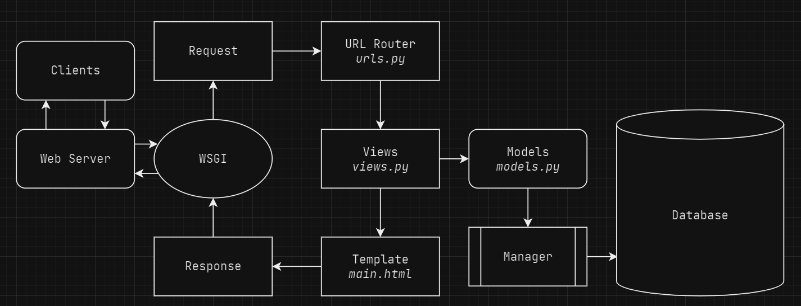

# [Django's Inventory](http://alfian-fadhlurrahman-tugas.pbp.cs.ui.ac.id/)
#### Alfian Fadhlurrahman | 2206821683

## Assignment Steps
- #### Create a new Django project.
 I started the Django project by creating a new git repository. after that I initialize the virtual environment by running the command `python -m venv env`, and then activated it with `env\Scripts\activate.bat`. After that, I set up dependencies and started creating the django project by:
1. Creating requirements.txt
```
django
gunicorn
whitenoise
psycopg2-binary
requests
urllib3
```
2. Installing requirements
```bash
pip install -r requirements.txt"
```
3. Create a new django project
```bash
django-admin startproject django_inv .
```
4. Set `ALLOWED_HOST` to any in `settings.py` for deployment purposes
```
...
ALLOWED_HOST = ["*"]
...
```
* #### Create an app with the name main on that project.
	by running `python manage.py startapp main` to create the main application. and then registering it into the project by adding main to INSTALLED_APPS in `settings.py`
```python
# django_inv/settings.py
INSTALLED_APPS = [
    ...,
    'main',
    ...
]
```
- #### Create a URL routing configuration to access the main app.
by filling `urls.py` **inside** the `main` application directory with:
```python
from django.urls import path
from main.views import show_main

app_name = 'main'

urlpatterns = [
    path('', show_main, name='show_main'),
]
```

- #### Create a model on the main app with name Item and it's attributes:
by filling `models.py` inside `main` with:
```python
from django.db import models

class  Item(models.Model):
	name = models.CharField(max_length=100)
	date_added = models.DateField(auto_now_add=True)
	amount = models.IntegerField()
	description = models.TextField()
	category = models.TextField()
	price = models.IntegerField()
```

- #### Create a function in `views.py` that returns an HTML template containing your application name, your name, and your class.
1. Create a `main.html` in `main/templates`
```html
# main/templates/main.html
<h1>Django's Inventory</h1>

<h5>Name: </h5>
<p>{{ name }}</p>

<h5>Class: </h5>
<p>{{ class }}</p>
```
2. Create the view function in `views.py`
```python
# main/views.py
...
def  show_main(request):
	context =  {
		'name':  'Alfian Fadhlurrahman',
		'class':  'PBP KKI'
	}
		return  render(request,  'main.html', context)
...
```
- #### Create a routing in `urls.py` to map the function in `views.py` to an URL.
filling `urls.py` file **inside** the project's  `django_inv`  directory, not within the  `main`  application.
```python
from django.contrib import admin
from django.urls import path, include

urlpatterns =  [
	path('admin/', admin.site.urls),
	path('main/',  include('main.urls')),
]
```
- #### Deploy your app to Adaptable so it can be accessed through the internet.
My account has been disabled in Adaptable :(

## Flow of Client Requests to a Django Web App 


the flow of client requests to a Django web app invovles routing the request through `urls.py` to the appropriate view function in `views.py`. The view function interacts with the model in `models.py` to retrieve or modify data and then renders an HTML template, which forms the HTTP response sent back to the client for display in the browser.

## Virtual Environment
A virtual environment in software development serves to create isolated and self-contained environments for Python projects, primarily for dependency isolation, version compatibility, and maintaining a clean development environment. While it is technically possible to create a Django web app without a virtual environment, it is strongly discouraged due to potential dependency conflicts, lack of isolation, and reduced portability. Using a virtual environment is highly recommended for Django web app development as it ensures a well-defined and isolated environment, making it easier to manage dependencies, prevent conflicts, and ensure consistent and reproducible project setups across different environments and deployments.

## MVC, MVT, MVVM
**MVC** (Model-View-Controller):
MVC is a pattern that emphasizes the separation of concerns between data, user interface, and control logic. It is commonly used in web applications, desktop applications, and other user-facing software.

**MVT** (Model-View-Template):
MVT is a pattern commonly used in web frameworks like Django (Python) and Ruby on Rails (Ruby). It is similar to MVC but separates the View and Template layers more explicitly for web development.

**MVVM** (Model-View-ViewModel):
MVVM is commonly used in modern front-end and mobile app development, especially with frameworks like Angular (for web apps), Xamarin (for mobile apps), and WPF (Windows Presentation Foundation). It aims to improve the separation of concerns by introducing the ViewModel layer, which simplifies UI development.

## What is the difference between `POST` form and `GET` form in Django?
**GET form:**
-   Appends the form data to the URL in a query string.
-   Data is visible in the URL, which means it has limitations on the amount of data that can be sent (due to URL length restrictions).
-   GET is suitable for data retrieval and should not be used for sensitive or confidential information, as the data is visible in the URL.
-   It is cached by browsers and can be bookmarked, making it suitable for search forms or sharing URLs.

**POST form:**
-   Sends the form data in the body of the HTTP request.
-   Data is not visible in the URL, making it suitable for sensitive or large amounts of data.
-   POST does not have limitations on the amount of data that can be sent.
-   It's secure and suitable for actions that modify data on the server (e.g., creating, updating, deleting).

## What are the main differences between XML, JSON, and HTML in the context of data delivery?
XML and JSON are primarily used for data interchange and storage, with JSON being more lightweight and easy to read/write. HTML, on the other hand, is focused on defining the structure and presentation of web content.

## Why is JSON often used in data exchange between modern web applications?
JSON is a popular choice for data exchange in modern web applications due to its simplicity, compatibility with JavaScript, language agnosticism, efficiency, lightweight nature, standardization, and support for complex data structures.

## Assignment Steps #2
-   #### Create a  `form`  input to add a model object to the previous app.
1. Create a new folder named `template` in root directory and add base.html into it with the code:
```html

<!DOCTYPE html>
<html lang="en">
    <head>
        <meta charset="UTF-8" />
        <meta
            name="viewport"
            content="width=device-width, initial-scale=1.0"
        />
        
        
    </head>

    <body>
        
        
    </body>
</html>
```
2. edit `settings.py` in the `django_inv` folder to detect base.html as a template file
```python
# django_inv/settings.py
...
TEMPLATES = [
	{
		...
		'DIRS':  [BASE_DIR /  'templates'],
		...
	}
]
...
```
3. use base template in `main/templates/main.html` by adding:
```html


...

```

4. create new `forms.py` inside the main folder
```python
from django.forms import ModelForm
from main.models import Item

class  ItemForm(ModelForm):
	class  Meta:
		model = Item
		fields =  ["name",  "amount",  "category",  "price",  "description"]
```
5. add items into the `show_main` function in `views.py`
```py
items = Item.objects.all()
context = {
	...
	'items': items
}
```

6. create a new file in `main/templates` directory named `create_item.html`
```html
 


<h1>Add New Product</h1>

<form method="POST">
    
    <table>
        {{ form.as_table }}
        <tr>
            <td></td>
            <td>
                <input type="submit" value="Add Product"/>
            </td>
        </tr>
    </table>
</form>


```
7. add this code to `main.html` to see the item list and a button to create new item:
```html
...
<table>
    <tr>
        <th>Name</th>
        <th>Price</th>
        <th>Description</th>
        <th>Date Added</th>
    </tr>

     Below is how to show the product data 

    
        <tr>
            <td>{{product.name}}</td>
            <td>{{product.price}}</td>
            <td>{{product.description}}</td>
            <td>{{product.date_added}}</td>
        </tr>
    
</table>

<br />

<a href="">
    <button>
        Add New Product
    </button>
</a>

 
```
#### Add 5  `views`  to view the added objects in HTML, XML, JSON, XML by ID, and JSON by ID formats.
by adding these to `views.py`
```python
from django.http import HttpResponseRedirect
from django.urls import reverse
from django.http import HttpResponse
from django.core import serializers
from main.forms import ItemForm
from main.models import Item
...

...
def  create_item(request):
form =  ItemForm(request.POST  or  None)
	if form.is_valid()  and request.method ==  "POST":
		form.save()
		return  HttpResponseRedirect(reverse('main:show_main'))
context =  {'form': form}
return  render(request,  "create_item.html", context)

def  show_xml(request):
	data = Item.objects.all()
	return  HttpResponse(serializers.serialize("xml", data),content_type="application/xml")

def  show_json(request):
	data = Item.objects.all()
	return  HttpResponse(serializers.serialize("json", data),content_type="application/json")

def  show_xml_by_id(request,  id):
	data = Item.objects.filter(pk=id)
	return  HttpResponse(serializers.serialize("xml", data),content_type="application/xml")

def  show_json_by_id(request,  id):
	data = Item.objects.filter(pk=id)
	return  HttpResponse(serializers.serialize("json", data),content_type="application/json")
```

#### Create URL routing for each of the views added in point 2.
1.  Open the `urls.py` file located in the `main` folder and import the functions.
```py
from main.views import show_main, create_item, show_xml, show_json, show_xml_by_id, show_json_by_id
```
2. Add URL paths to the `urlpatterns` list to access the imported functions.
```py
...
path('create_item', create_item,  name='create_item'),
path('xml/', show_xml,  name='show_xml'),
path('json/', show_json,  name='show_json'),
path('xml/<int:id>/', show_xml_by_id,  name='show_xml_by_id'),
path('json/<int:id>/', show_json_by_id,  name='show_json_by_id'),
...
```

#### Access the five URLs in point 2 using Postman, take screenshots of the results in Postman, and add them to README.md.
<br />
<br />
<br />
<br />
<br />

## What is  `UserCreationForm`  in Django? Explain its advantages and disadvantages.
Django's pre-built form class, `UserCreationForm`, makes it easier to create user accounts by including standard fields for username, password, and email, among other things. It makes ensuring that data is validated, cutting down on development time and fostering uniformity. Customization, however, is restricted and not particularly appropriate for complicated or heavily customized registration forms.

## What is the difference between authentication and authorization in Django application? Why are both important?
Authentication verifies a user's identity using specified credentials, such as a username and password. What activities or resources an authenticated user is allowed to access within the program is determined by authorization. In order to limit access and protect sensitive data, authorization is just as important as authentication in making sure users are who they say they are. Both are essential for user experience customization based on roles and permissions, security, data protection, limited access, and compliance.

## What are  `cookies`  in website? How does Django use  `cookies`  to manage user session data?
Cookies are data files that users' browsers store to keep track of their preferences and interactions. By saving a distinct session ID in the user's browser, cookies are used to manage user sessions. By connecting session-specific data saved on the server, this session ID helps maintain security and user identity. In order to improve privacy and enable safe session management with options for data expiration and cleanup, the actual session data is kept on the server.

## Are  `cookies`  secure to use? Is there potential risk to be aware of?
Although cookies are generally safe, inappropriate handling can provide problems. They have the capacity to hold sensitive data, so it's crucial to avoid keeping sensitive information there. Input validation and escape techniques should be used to stop XSS attacks, and HTTPS should be used to guard against data interception. 

## Assignment Steps #3
-  #### Implement registration, login, and logout functions to allow users to access the previous application.
1. Import redirect, UserCreationForm, and messages to `views.py`
2. Create the functions in `views.py`:
```py
def  register(request):
	form =  UserCreationForm()
	
	if request.method ==  "POST":
		form =  UserCreationForm(request.POST)
		if form.is_valid():
			form.save()
			messages.success(request,  'Your account has been successfully created!')
			return  redirect('main:login')
	context =  {'form':form}
	return  render(request,  'register.html', context)

def  login_user(request):
	if request.method ==  'POST':
		username = request.POST.get('username')
		password = request.POST.get('password')
		user =  authenticate(request,  username=username,  password=password)
		if user is  not  None:
			login(request, user)
			response =  HttpResponseRedirect(reverse("main:show_main"))
			response.set_cookie('last_login',  str(datetime.datetime.now()))
			return response
		else:
			messages.info(request,  'Sorry, incorrect username or password. Please try again.')
	context =  {}
	return  render(request,  'login.html', context)

def  logout_user(request):
	logout(request)
	response =  HttpResponseRedirect(reverse('main:login'))
	response.delete_cookie('last_login')
	return response
```    
3. Create HTML file for the register & login function, named `register.html` and `login.html` in main\templates.
4. Import all the functions into `urls.py` and add new path url to urlpatterns

-  #### Create  **two**  user accounts with  **three**  dummy data entries for each account using the model previously created in the application.
Did this by activating virtual environment and running the server with `python manage.py runserver`. Then I went to `localhost:8000` and created 2 accounts with 3 dummy data.
    
-  #### Connect  `Item`  model with  `User`.
Import `user` from `django.contrib.auth.models` in `models.py`, then add 
```py
user = models.ForeignKey(User, on_delete=models.CASCADE)
```
to the existing item class. In `views.py` modify create_item with
```py
def  create_item(request):  
form = ItemForm(request.POST or  None)  
  
if form.is_valid()  and request.method ==  "POST":  
item = form.save(commit=False)  
item.user = request.user  
item.save()  
return HttpResponseRedirect(reverse('main:show_main'))
```
and show_main with:
```py
def  show_main(request):  
products = Product.objects.filter(user=request.user)  
  
context =  {  
'name': request.user.username,
```
lastly, save all changes and run the migrations for the model using `python manage.py makemigrations` & `python manage.py migrate`
    
-  #### Display the information of the logged-in user, such as their username, and applying  `cookies`, such as  `last login`, on the main application page.
modify login_user in `models.py` with:
```py
...
if user is not None:
    login(request, user)
    response = HttpResponseRedirect(reverse("main:show_main")) 
    response.set_cookie('last_login', str(datetime.datetime.now()))
    return response
...
```
then add `'last_login': request.COOKIES['last_login']` to the context in `show_main` function.
modify `logout_user` with:
```py
def logout_user(request):
    logout(request)
    response = HttpResponseRedirect(reverse('main:login'))
    response.delete_cookie('last_login')
    return response
```
then add `<h5>Last login session: {{ last_login }}</h5>` to `main.html`

## Explain the purpose of some CSS element selector and when to use it.

- `type selector` targets specific HTML elements by their tag name, allowing you to style all instances of a particular element type. For instance, h1 targets all level-one headings for styling.

- `class selector` is used to style multiple HTML elements that share a common class attribute. By applying a class selector (e.g., .highlight), you can style various elements with the same class, such as highlighting specific content.

- `id selector` is employed to style a unique HTML element identified by its unique ID attribute. Using the id selector (e.g., #header), you can apply styles to a single, distinct element on the webpage. It's crucial to note that while multiple elements can share a class, an ID should be unique within the HTML document.

## Explain some of the HTML5 tags that you know.
-  `<header>` --- Defines the header or top section of a webpage, typically containing headings, navigation, and introductory content.

-  ` <nav>` ---  Specifies a section of the document intended for navigation links, menus, or a table of contents.

- `<section>` --- Represents a thematic grouping within a document, often used to group related content and provide a clear semantic structure.

## What are the differences between margin and padding?
-   `Margin` --- the space outside an element, creating separation between the element and its surrounding elements.
-   `Padding` --- the space inside an element, creating separation between the element's content and its border.

## What are the differences between the CSS framework Tailwind and Bootstrap? When should we use Bootstrap rather than Tailwind, and vice versa?
1. Tailwind
	- builds layouts by combining pre-defined utility classes.
	- has a smaller CSS file compared to Bootstrap and only loads the utility classes used.
	- offers high flexibility and adaptability to projects.
	- Learning Tailwind CSS can have a steeper learning curve because it requires understanding and combining available utility classes.
2. Bootstrap
	- uses predefined styles and components with ready-made designs that can be used directly.
	- has a larger CSS file due to the inclusion of many predefined components.
	- often produces more consistent designs throughout a project as it uses predefined components.
	- offers a quicker learning curve for beginners as they can start with predefined components.

use Bootstrap for projects that require faster prototyping, ease of use, and a wide range of pre-styled components. On the other hand, choose Tailwind CSS for highly customizable and utility-first approaches, focusing on maintainability, scalability, and a developer-centric experience.

## Assignment Steps #4
- Adding Bootstrap
add this code to the head of `base.html`
```html
<link  href="https://cdn.jsdelivr.net/npm/bootstrap@5.3.2/dist/css/bootstrap.min.css"  rel="stylesheet"  integrity="sha384-T3c6CoIi6uLrA9TneNEoa7RxnatzjcDSCmG1MXxSR1GAsXEV/Dwwykc2MPK8M2HN"  crossorigin="anonymous">
<script  src="https://code.jquery.com/jquery-3.6.0.min.js"  integrity="sha384-KyZXEAg3QhqLMpG8r+J4jsl5c9zdLKaUk5Ae5f5b1bw6AUn5f5v8FZJoMxm6f5cH1"  crossorigin="anonymous"></script>
<script  src="https://cdn.jsdelivr.net/npm/@popperjs/core@2.11.8/dist/umd/popper.min.js"  integrity="sha384-I7E8VVD/ismYTF4hNIPjVp/Zjvgyol6VFvRkX/vR+Vc4jQkC+hVqc2pM8ODewa9r"  crossorigin="anonymous"></script>
<script  src="https://cdn.jsdelivr.net/npm/bootstrap@5.3.2/dist/js/bootstrap.min.js"  integrity="sha384-BBtl+eGJRgqQAUMxJ7pMwbEyER4l1g+O15P+16Ep7Q9Q+zqX6gSbd85u4mG4QzX+"  crossorigin="anonymous"></script>
```
- Customizing the website
Changed the background color, layout, and the way to view the items by making it into cards, did this by using the provided bootstrap predefined styles and components, and some custom CSS that is located in a static file inside the django app folder.

## Explain the difference between  **asynchronous programming**  and  **synchronous programming**.

* `synchronous programming`
executes tasks one after the other, blocking until each task is completed
* `asynchronous programming` 
initiates tasks and continues without blocking, handling the results via callbacks or other mechanisms once the tasks are finished.

## In the implementation of JavaScript and AJAX, there is an implemented paradigm called  **the event-driven programming paradigm**. Explain what this paradigm means and give one example of its implementation in this assignment.

Event-driven programming is a paradigm where the flow of the program is determined by events such as user interactions. One of its implementation in this assignment is a button to add new item and update the list of items without refreshing the page.

## Explain the implementation of asynchronous programming in AJAX.
by making asynchronous request to the HTTP Server using the async and await command. Those command will wait for an input to then be executed without refreshing the web page.

## In this semester, the implementation of AJAX is done using the Fetch API rather than the jQuery library. Compare the two technologies and write down your opinion which technology is better to use.
* AJAX
`Ajax` is a technique used to send and retrieve data from a server asynchronously without requiring a page refresh. It allows for dynamic updates of content on a webpage without a full reload.

* jQuery
`jQuery` is a JavaScript library that simplifies DOM manipulation, event handling, animations, and AJAX interactions. It provides a set of pre-built functions and utilities to make web development easier and more efficient.

In my opinion, `Fetch API` is better to use because it is more modern and its syntax are simpler than jQuery.

## Assignment Steps #5
1. Import  `from django.views.decorators.csrf import csrf_exempt`  in  `views.py`.
2. Create AJAX function in `views.py` and add urlpattern for the functions in `urls.py`
``` py
# views.py
def get_item_json(request): # get item objects
    item = Item.objects.filter(user=request.user)
    return HttpResponse(serializers.serialize('json', item))

@csrf_exempt
def create_ajax(request): # create item function
    if request.method == 'POST':
        name = request.POST.get("name")
        amount = request.POST.get("amount")
        price = request.POST.get("price")
        category = request.POST.get("category")
        description = request.POST.get("description")
        user = request.user

        new_item = Item(name=name, amount=amount, price=price, category=category, description=description, user=user)
        new_item.save()

        return HttpResponse(b"CREATED", status=201)

    return HttpResponseNotFound()

@csrf_exempt
def delete_ajax(request, id): # delete item function
    item = Item.objects.get(pk=id)
    item.delete()
    return HttpResponse(b"DELETED", status=201)

@csrf_exempt
def increment_ajax(request, id): # increment item function
    item = Item.objects.get(pk=id)
    item.amount += 1
    item.save()
    return HttpResponse(b"INCREMENTED", status=201)

@csrf_exempt
def decrement_ajax(request, id): # decrement item function
    item = Item.objects.get(pk=id)
    item.amount -= 1
    if item.amount <= 0:
        item.delete()
        return HttpResponse(b"DELETED", status=201)
    else:
        item.save()
        return HttpResponse(b"DECREMENTED", status=201)
```
```py
# urls.py
...
	path('get-item/', get_item, name='get_item'),
	path('create-ajax/', create_ajax, name='create_ajax'),
    path('delete-ajax/<int:id>', delete_ajax, name='delete_ajax'),
    path('increment-ajax/<int:id>', increment_ajax, name='increment_ajax'),
    path('decrement-ajax/<int:id>', decrement_ajax, name='decrement_ajax')
...
```
3. Create a table in the main.html with `<table  id="item_table"></table>`
4. Create a script for showing the item using `fetch()` API
```js
<script>
async  function  getItems() {
	return  fetch("").then((res)  => res.json())
}
</script>
```
5. Create another async function for refreshing the items asynchronously
```js
async function refreshItems() {
        document.getElementById("item_table").innerHTML = ""
        const items = await getItems()
        let htmlString = `<div class="row row-cols-1 row-cols-md-5 g-4">`
        items.forEach((item) => {
            htmlString += `\n<div class="col">
                <div class="card h-100 border-primary">
                    <div class="card-body">
                        <h5 class="card-title">${item.fields.name} - ${item.fields.amount}</h5>
                        <h6 class="card-subtitle mb-2 text-muted">$ ${item.fields.price}</h6>
                        <p class="card-text">${item.fields.description}</p>
                    </div>
                    <div class="card-footer">
                        <button type="button" class="btn btn-outline-secondary" onclick="decItem(${item.pk})">-</button>
                        <button type="button" class="btn btn-outline-secondary" onclick="incItem(${item.pk})">+</button>
                        <button type="button" class="btn btn-danger" onclick="delItem(${item.pk})">Delete</button>
                    </div>
                </div>
            </div>` 
        })
        htmlString += '\n</div>'
        
        document.getElementById("item_table").innerHTML = htmlString
    }

    refreshItems()
```
6. Create a modal form to add item
```html
<div class="modal fade" id="exampleModal" tabindex="-1" aria-labelledby="exampleModalLabel" aria-hidden="true">
    <div class="modal-dialog">
        <div class="modal-content">
            <div class="modal-header">
                <h1 class="modal-title fs-5" id="exampleModalLabel">Add New Item</h1>
                <button type="button" class="btn-close" data-bs-dismiss="modal" aria-label="Close"></button>
            </div>
            <div class="modal-body">
                <form id="form" onsubmit="return false;">
                    
                    <div class="mb-3">
                        <label for="name" class="col-form-label">Name:</label>
                        <input type="text" class="form-control" id="name" name="name"></input>
                    </div>
                    <div class="mb-3">
                        <label for="amount" class="col-form-label">Amount:</label>
                        <input type="number" class="form-control" id="amount" name="amount"></input>
                    </div>
                    <div class="mb-3">
                        <label for="price" class="col-form-label">Price:</label>
                        <input type="number" class="form-control" id="price" name="price"></input>
                    </div>
                    <div class="mb-3">
                        <label for="category" class="col-form-label">Category:</label>
                        <input type="text" class="form-control" id="category" name="category"></input>
                    </div>
                    <div class="mb-3">
                        <label for="description" class="col-form-label">Description:</label>
                        <textarea class="form-control" id="description" name="description"></textarea>
                    </div>
                </form>
            </div>
            <div class="modal-footer">
                <button type="button" class="btn btn-secondary" data-bs-dismiss="modal">Close</button>
                <button type="button" class="btn btn-primary" id="button_add" data-bs-dismiss="modal">Add Item</button>
            </div>
        </div>
    </div>
</div>
```
and add a button to access the modal using `<button  type="button"  class="btn btn-primary"  data-bs-toggle="modal"  data-bs-target="#exampleModal">+</button>`

7. Create a function to add item in `<script>`
```js
function addItem() {
        fetch("", {
            method: "POST",
            body: new FormData(document.querySelector('#form'))
        }).then(refreshItems)

        document.getElementById("form").reset()
        return false
    }
    
document.getElementById("button_add").onclick  = addItem
```

8. Bonus: Create a delete item
I created the delete function with inspiration from the addItem function
```js
function delItem(id) {
        fetch("/delete-ajax/" + id,{
            method: "POST"
        }).then(refreshItems)

        document.getElementById("form").reset()
        return false
    }
```
add a delItem button with `<button type="button" class="btn btn-danger" onclick="delItem(${item.pk})">Delete</button>`